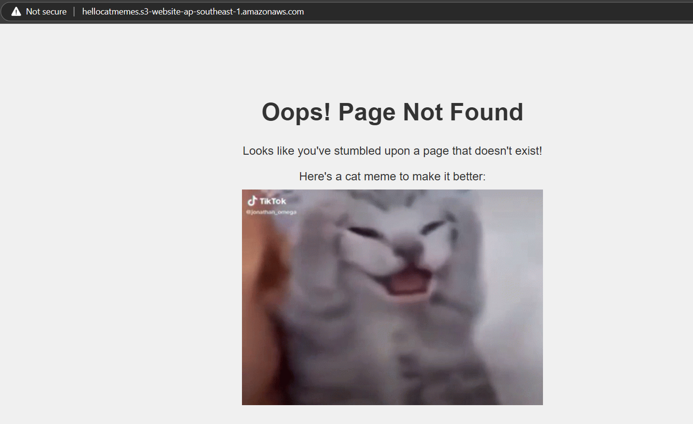

# Hosting a Static Website on AWS S3

This project demonstrates how to host a static website on Amazon S3. The goal is to serve a website that acts as a knowledge base and project repository, which can be shared as part of a portfolio or resume.

## Project Overview
Amazon S3 (Simple Storage Service) is a secure, durable, and highly scalable object storage service. Hosting a static website on S3 is ideal for lightweight sites such as blogs, portfolios, and documentation.

## Features
- Static Website Hosting: Host HTML, CSS, and JavaScript files without needing a web server.
- Cost-Effective: Pay only for the storage and requests made to the site.
- Scalable and Durable: Backed by Amazon's reliable infrastructure.
- Custom Domain Support: Option to use a custom domain with AWS Route 53.

## Prerequisites
- AWS Account: Ensure you have access to AWS services with permissions to manage S3.

- AWS CLI: Install the AWS CLI and configure it with your credentials.

- S3 Bucket: Create a bucket in the region closest to your audience (this guide uses the Singapore region).

## Steps to Host the Website

### Step 1: Create an S3 Bucket

1. Log in to your AWS Management Console.
2. Navigate to the **S3** service.
3. Click on **Create bucket**.
4. Enter a unique bucket name (e.g., `your-website-name`) and choose your preferred region.
5. Uncheck **Block all public access** to allow public access to your website. Acknowledge the warning.
6. Click **Create bucket**.

### Step 2: Upload Your Website Files

1. Open your newly created bucket.
2. Click on **Upload** and select the files you want to host. This typically includes HTML, CSS, JavaScript, images, etc.
3. Once uploaded, ensure all files are accessible.

### Step 3: Set Bucket Policy for Public Access

1. Go to the **Permissions** tab in your S3 bucket.
2. Scroll down to **Bucket policy** and add the following policy, replacing `your-bucket-name` with your actual bucket name:

   ```json
   {
     "Version": "2012-10-17",
     "Statement": [
       {
         "Sid": "PublicReadGetObject",
         "Effect": "Allow",
         "Principal": "*",
         "Action": "s3:GetObject",
         "Resource": "arn:aws:s3:::your-bucket-name/*"
       }
     ]
   }
   ```

### Step 4: Enable Static Website Hosting

1. Go to the "Properties" tab in your S3 bucket.
2. Scroll down to "Static website hosting" and select "Enable."
3. Choose "Host a static website."
4. Set the index document (e.g., index.html).
5. Optionally, specify an error document (e.g., error.html).
5. Save the changes.

###  Step 5: Access Your Website
You’ll see a URL provided in the "Static website hosting" section `(e.g., http://your-bucket-name.s3-website-ap-southeast-1.amazonaws.com)`.
This URL is now the public URL for your static website.


In case the main website fails it redirects to an error page.

